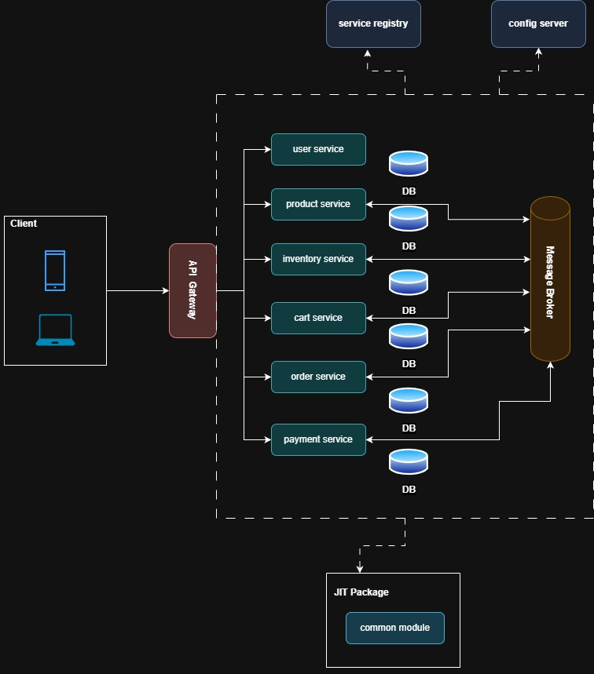

# E-Commerce Backend (Microservices)
A Spring Boot–based microservices architecture using Eureka, Config Server, API Gateway, Kafka, and MongoDB. Each service runs independently and communicates through REST and Kafka.

## Architecture Diagram


## Tech Stack
- Spring Boot (Microservices)
- Spring Cloud (Eureka, Config Server, Gateway)
- Kafka & Zookeeper
- MongoDB
- Docker & Docker Compose
- JitPack dependency host (common-module)

## Services
- service-registry
- config-server
- api-gateway
- user-service
- product-service
- inventory-service
- order-service
- cart-service
- payment-service
- MongoDB databases (one per service)
- Kafka & Zookeeper

## Prerequisites
- Docker & Docker Compose installed
- JDK 17 (if building manually)
- Gradle

## Run the System

1. Clone the repository:
   ```bash
   git clone https://github.com/sahanmvs/ecommerce-backend.git
   
2. Environment Variables
```md
## Create a file named .env in the same folder where the docker-compose.yaml is located.

- JWT_SECRET
- STRIPE_SECRET
- STRIPE_WEBHOOK_SECRET
- WEB_URL
```
3. Build all microservice Docker images:
   ```bash
   docker-compose build
4. Start all services:
   ```bash
   docker-compose up

5. Access main components:
- Eureka Dashboard: http://localhost:8761
- Config Server: http://localhost:8888
- API Gateway: http://localhost:8080

6. API Documentation

   Each microservice exposes Swagger at: http://localhost:<service-port>/swagger-ui.html


## Folder Structure
```md
/api-gateway
/cart-service
/config-server
/inventory-service
/order-service
/product-service
/payment-service
/service-registry
/user-service
.env
docker-compose.yml
```

## TODO / Future Enhancements
- Add Prometheus + Grafana for monitoring
- Add notification service
- Add JWT refresh token flow
- Add rate-limiting & circuit breakers (Resilience4j)
- prod deployment


